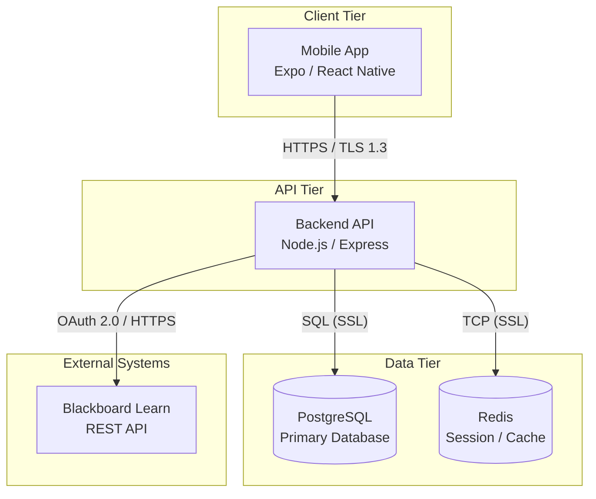
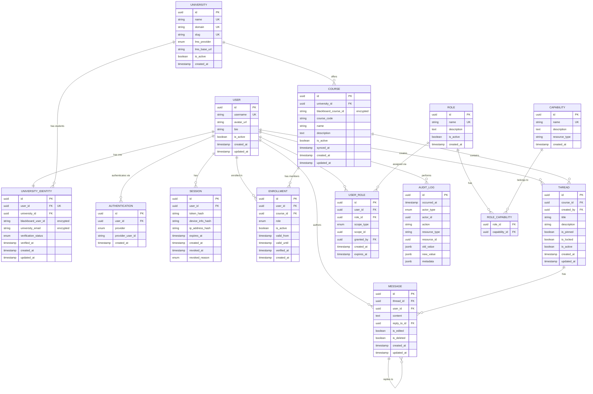
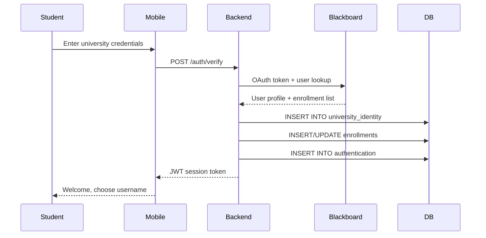
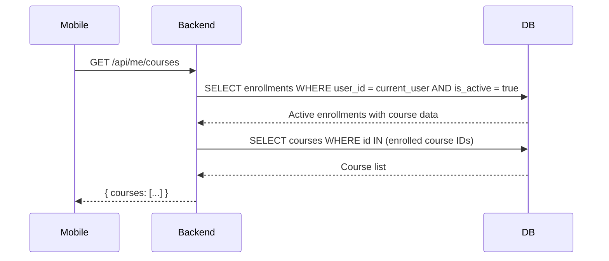
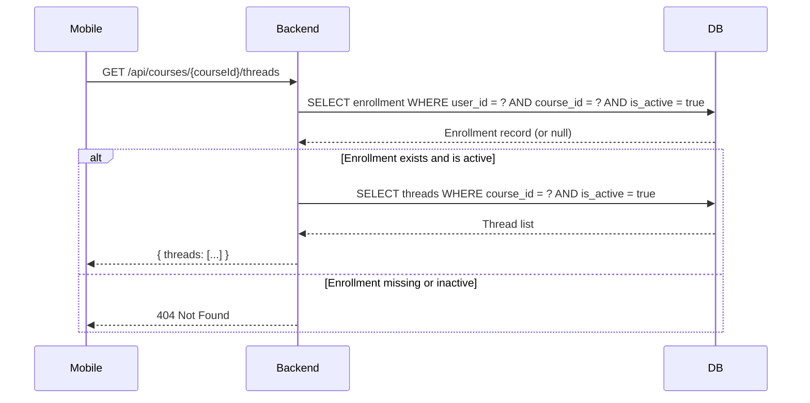
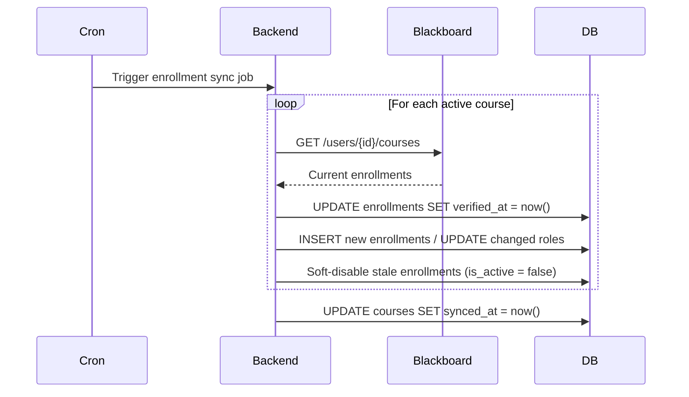

# Database Architecture Design Document

## Student App Platform — Schoen Cyber Solutions LLC

**Version:** 0.2.1 (Living Document)
**Date:** 2026-09-09
**Status:** Design Phase — Ready for Implementation
**Classification:** Internal — Schoen Cyber Solutions Engineering

---

## Table of Contents

1. [Database Principles](#1-database-principles)
2. [High-Level Architecture](#2-high-level-architecture)
3. [MVP Scope](#3-mvp-scope)
4. [Core Entities](#4-core-entities)
5. [Authentication & Authorization](#5-authentication--authorization)
6. [Audit Logging](#6-audit-logging)
7. [Entity Relationship Diagram](#7-entity-relationship-diagram)
8. [Relationships](#8-relationships)
9. [Data Flow](#9-data-flow)
10. [Security Requirements](#10-security-requirements)
11. [Schema Reference](#11-schema-reference)
12. [Future Extensions](#12-future-extensions)

---

## 1. Database Principles

| Principle | Application |
|---|---|
| **Data Minimization** | Store only data required for app functionality. Grades, assignments, and private university records are excluded. |
| **Privacy by Design** | University identity is stored separately from public identity. Students control their public representation. |
| **Least Privilege** | Database credentials have minimal permissions. Backend services use role-specific database users. |
| **Separation of Identities** | `UniversityIdentity` and `User` are separate tables. Public APIs never join across this boundary. |
| **Secure Storage** | Sensitive fields use application-level encryption. Secrets never stored in the database. |
| **Audit Trail** | Security-relevant events are logged immutably. |
| **No Mobile Direct Access** | The mobile application never connects directly to the database. All access flows through the backend API. |
| **Secure by Default** | No public endpoints without authentication; secrets excluded from Git by default. |

---

## 2. High-Level Architecture



### Architecture Rules

- **Mobile App** communicates only with Backend API. No database credentials.
- **Backend API** is the only component with database access.
- **PostgreSQL** is the primary relational database.
- **Redis** handles session cache and rate-limiting counters.
- **Blackboard** is the external source of truth for identity and enrollment.

---

## 3. MVP Scope

### Included in MVP

| Feature | Entities |
|---|---|
| User accounts with public usernames | `User` |
| University verification | `UniversityIdentity`, `University` |
| Blackboard OAuth integration | — (connector-level) |
| Enrollment-based authorization | `Enrollment` |
| Course communities with threads | `Course`, `Thread`, `Message` |
| Authentication & sessions | `Authentication`, `Session` |
| Role-based permissions | `Role`, `Capability`, `RoleCapability` |
| Audit logging | `AuditLog` |

### Deferred to Post-MVP

| Feature | Entities |
|---|---|
| File attachments in messages | `Attachment` |
| Message reactions | `Reaction` |
| Push/email notifications | `Notification` |
| Calendar events | `Event` |
| Advanced moderation queue | `Report` |
| User blocking | `UserBlock` |
| User preferences | `Preference` |

---

## 4. Core Entities

### 4.1 User

**Purpose:** Stores the internal application identity and public profile.
**Status:** MVP

| Field | Type | Constraints | Description |
|---|---|---|---|
| `id` | UUID | PK | Internal user ID. Never exposed to other users. |
| `username` | VARCHAR(30) | UNIQUE, NOT NULL | Public username chosen by the student. |
| `avatar_url` | TEXT | nullable | Optional profile picture URL. |
| `bio` | VARCHAR(200) | nullable | Optional short biography. |
| `is_active` | BOOLEAN | DEFAULT true | Account status. |
| `created_at` | TIMESTAMPTZ | DEFAULT now() | Account creation. |
| `updated_at` | TIMESTAMPTZ | DEFAULT now() | Last profile update. |

**Security Notes:**
- `id` is an internal UUID. Other students never see it.
- `username` is the only user-facing identifier.
- No university email, real name, or Blackboard ID in this table.

**Username Validation Rules:**
- Allowed characters: alphanumeric, underscore (`_`), hyphen (`-`), dot (`.`), apostrophe (`'`)
- Minimum length: 3 characters
- Maximum length: 30 characters
- Lowercase enforced for uniqueness
- No leading/trailing dots, underscores, or hyphens
- Max 2 consecutive special characters
- Prohibited: reserved names (`admin`, `support`, `official`, `university`, `moderator`)
- Prohibited: impersonation of staff, slurs, hate speech

---

### 4.2 UniversityIdentity

**Purpose:** Stores verified university identity. The most sensitive table.
**Status:** MVP

| Field | Type | Constraints | Description |
|---|---|---|---|
| `id` | UUID | PK | Internal record ID. |
| `user_id` | UUID | FK -> users.id, UNIQUE, NOT NULL | Links to public User record. |
| `university_id` | UUID | FK -> universities.id, NOT NULL | Links to University record. |
| `blackboard_user_id` | VARCHAR(255) | encrypted | Blackboard internal user ID (e.g., `_7_1`). |
| `university_email` | VARCHAR(255) | encrypted, nullable | University email. Stored only if required. |
| `verification_status` | ENUM | NOT NULL | `pending` / `verified` / `expired` / `revoked` |
| `verified_at` | TIMESTAMPTZ | nullable | Timestamp of successful verification. |
| `created_at` | TIMESTAMPTZ | DEFAULT now() | Record creation. |
| `updated_at` | TIMESTAMPTZ | DEFAULT now() | Last update. |

**Security Rules:**
- Never exposed through public APIs.
- Never returned in user profile endpoints.
- PostgreSQL Row-Level Security (RLS) prevents accidental cross-table joins with `users`.
- Sensitive columns encrypted at rest with application-level encryption.

**Data Minimization:**
- `student_id_number` is **not stored**.
- `university_email` stored only if verification flow requires it.

---

### 4.3 University

**Purpose:** Stores supported universities and system configurations.
**Status:** MVP

| Field | Type | Constraints | Description |
|---|---|---|---|
| `id` | UUID | PK | Internal university ID. |
| `name` | VARCHAR(255) | NOT NULL, UNIQUE | Human-readable name. |
| `domain` | VARCHAR(255) | NOT NULL, UNIQUE | Email domain (e.g., `roosevelt.edu`). |
| `slug` | VARCHAR(50) | NOT NULL, UNIQUE | URL-safe identifier (e.g., `roosevelt`). |
| `lms_provider` | ENUM | NOT NULL | `blackboard` / `canvas` / `d2l` / `moodle` |
| `lms_base_url` | VARCHAR(500) | nullable | Base URL for the LMS REST API. |
| `is_active` | BOOLEAN | DEFAULT true | Whether new enrollments are accepted. |
| `created_at` | TIMESTAMPTZ | DEFAULT now() | Record creation. |

**Example:**

```
name:     Roosevelt University
domain:   roosevelt.edu
slug:     roosevelt
lms:      blackboard
lms_url:  https://schoen-blackboard.ddns.net
```

---

### 4.4 Course

**Purpose:** Represents university courses available in the app.
**Status:** MVP

| Field | Type | Constraints | Description |
|---|---|---|---|
| `id` | UUID | PK | Internal course ID. |
| `university_id` | UUID | FK -> universities.id, NOT NULL | Links to the university. |
| `blackboard_course_id` | VARCHAR(255) | encrypted | Blackboard course identifier. |
| `course_code` | VARCHAR(50) | NOT NULL | Course code (e.g., `CSIA308`). |
| `name` | VARCHAR(255) | NOT NULL | Course name. |
| `description` | TEXT | nullable | Brief course description. |
| `is_active` | BOOLEAN | DEFAULT true | Whether the course community is active. |
| `synced_at` | TIMESTAMPTZ | nullable | Last time enrollment was synced with Blackboard. |
| `created_at` | TIMESTAMPTZ | DEFAULT now() | Record creation. |
| `updated_at` | TIMESTAMPTZ | DEFAULT now() | Last update. |

**Example:**

```
course_code:  CSIA308
name:         Cybersecurity Fundamentals
```

---

### 4.5 Enrollment

**Purpose:** Defines which students belong to which courses. Authorization backbone.
**Status:** MVP

| Field | Type | Constraints | Description |
|---|---|---|---|
| `id` | UUID | PK | Internal enrollment ID. |
| `user_id` | UUID | FK -> users.id, NOT NULL | The student. |
| `course_id` | UUID | FK -> courses.id, NOT NULL | The course. |
| `role` | ENUM | NOT NULL | `student` / `instructor` / `teaching_assistant` |
| `is_active` | BOOLEAN | DEFAULT true | Whether enrollment is currently valid. |
| `valid_from` | TIMESTAMPTZ | DEFAULT now() | Start of enrollment validity. |
| `valid_until` | TIMESTAMPTZ | nullable | End of enrollment validity. |
| `verified_at` | TIMESTAMPTZ | nullable | When last verified with Blackboard. |
| `created_at` | TIMESTAMPTZ | DEFAULT now() | Record creation. |

**Unique Constraint:** `(user_id, course_id)`

**Security Purpose:**
- Backend checks this table before allowing access to course threads.
- `valid_until` prevents graduated/dropped students from retaining access.
- `verified_at` enables periodic re-verification with Blackboard.

**Example:**

```
User:     CyberFox27
Course:   CSIA308
Role:     Student
```

---

### 4.6 Thread

**Purpose:** Student-created discussions inside courses.
**Status:** MVP

| Field | Type | Constraints | Description |
|---|---|---|---|
| `id` | UUID | PK | Internal thread ID. |
| `course_id` | UUID | FK -> courses.id, NOT NULL | The course this thread belongs to. |
| `created_by` | UUID | FK -> users.id, NOT NULL | The student who created the thread. |
| `title` | VARCHAR(255) | NOT NULL | Thread title. |
| `description` | VARCHAR(1000) | nullable | Optional opening description. |
| `is_pinned` | BOOLEAN | DEFAULT false | Pinned by an instructor. |
| `is_locked` | BOOLEAN | DEFAULT false | New messages blocked. |
| `is_active` | BOOLEAN | DEFAULT true | Whether the thread is visible. |
| `is_deleted` | BOOLEAN | DEFAULT false | Soft-delete flag for moderation. |
| `deleted_at` | TIMESTAMPTZ | nullable | When the thread was soft-deleted. |
| `created_at` | TIMESTAMPTZ | DEFAULT now() | Thread creation. |
| `updated_at` | TIMESTAMPTZ | DEFAULT now() | Last activity. |

**Security Rules:**
- Only enrolled users can create threads in a course.
- Only enrolled users can view threads in a course.
- Thread access controlled by course enrollment (backend enforces this).
- Thread creators do not automatically gain administrative privileges over the thread.
- Moderators and admins can pin, lock, or soft-delete threads for content management.

**Example:**

```
Course:   CSIA308
Title:    "Help with Assignment 2"
Author:   CyberFox27
```

**Moderation Note:**
Threads use soft-deletion (`is_deleted`, `deleted_at`) rather than permanent removal. This preserves thread history for audit and moderation review while hiding problematic content from users.

---

### 4.7 Message

**Purpose:** Replies inside threads.
**Status:** MVP

| Field | Type | Constraints | Description |
|---|---|---|---|
| `id` | UUID | PK | Internal message ID. |
| `thread_id` | UUID | FK -> threads.id, NOT NULL, indexed | The thread this message belongs to. |
| `user_id` | UUID | FK -> users.id, NOT NULL | The author (joined to `users.username` for display). |
| `content` | TEXT | NOT NULL | Message body. |
| `reply_to_id` | UUID | FK -> messages.id, nullable | For threaded replies. |
| `is_edited` | BOOLEAN | DEFAULT false | Whether the message has been edited. |
| `is_deleted` | BOOLEAN | DEFAULT false | Soft-delete flag. |
| `created_at` | TIMESTAMPTZ | DEFAULT now() | Send timestamp. |
| `updated_at` | TIMESTAMPTZ | DEFAULT now() | Edit timestamp. |

**Security Notes:**
- Public display uses `users.username` only.
- Soft delete preserves message history for moderation while hiding from users.
- Content validated and sanitized before storage.
- Authorization checked before any message operation.


---

## 5. Authentication & Authorization

### 5.1 Authentication

**Purpose:** Links users to external authentication providers.
**Status:** MVP

| Field | Type | Constraints | Description |
|---|---|---|---|
| `id` | UUID | PK | Internal record ID. |
| `user_id` | UUID | FK -> users.id, NOT NULL | The internal user. |
| `provider` | ENUM | NOT NULL | `blackboard` / `microsoft` / `google` / `apple` |
| `provider_user_id` | VARCHAR(255) | NOT NULL, indexed | The provider's unique user identifier. |
| `created_at` | TIMESTAMPTZ | DEFAULT now() | Record creation. |

**Example:**

```
User:     _internal_uuid_
Provider: blackboard
Provider ID: _7_1
```

### 5.2 Session

**Purpose:** Manages active user sessions and token lifecycle.
**Status:** MVP

| Field | Type | Constraints | Description |
|---|---|---|---|
| `id` | UUID | PK | Internal session ID. |
| `user_id` | UUID | FK -> users.id, NOT NULL | The authenticated user. |
| `token_hash` | VARCHAR(64) | NOT NULL, indexed | SHA-256 hash of the JWT or refresh token. |
| `device_info_hash` | VARCHAR(64) | nullable | Hash of user-agent fingerprint. |
| `ip_address_hash` | VARCHAR(64) | nullable | Hash of client IP address. |
| `expires_at` | TIMESTAMPTZ | NOT NULL | Session expiration time. |
| `created_at` | TIMESTAMPTZ | DEFAULT now() | Session creation. |
| `revoked_at` | TIMESTAMPTZ | nullable | When the session was revoked. |
| `revoked_reason` | ENUM | nullable | `logout` / `security` / `expired` |

**Security Purpose:**
- Session tokens and refresh tokens are **never stored in plaintext**. Only securely hashed representations (`token_hash`) are stored.
- Enables token revocation (server-side blacklist).
- Supports concurrent session limits.
- Provides login audit trail.
- Expired and revoked sessions are automatically rejected.

### 5.3 Role

**Purpose:** Defines platform roles.
**Status:** MVP — architecture is future-ready; MVP may initially use a smaller set of roles.

| Field | Type | Constraints | Description |
|---|---|---|---|
| `id` | UUID | PK | Internal role ID. |
| `name` | VARCHAR(50) | NOT NULL, UNIQUE | Role name (e.g., `Moderator`, `Instructor`, `Student`). |
| `description` | TEXT | nullable | Human-readable description. |
| `is_active` | BOOLEAN | DEFAULT true | Whether the role is active. |
| `created_at` | TIMESTAMPTZ | DEFAULT now() | Record creation. |

**MVP Note:** The MVP may initially ship with a small set of roles (`student`, `instructor`, `moderator`) while keeping the capability-based architecture extensible for future needs (e.g., `department_admin`, `platform_admin`).

### 5.4 Capability

**Purpose:** Defines granular permissions.
**Status:** MVP — architecture is future-ready

| Field | Type | Constraints | Description |
|---|---|---|---|
| `id` | UUID | PK | Internal capability ID. |
| `name` | VARCHAR(100) | NOT NULL, UNIQUE | Capability name (e.g., `thread:create`, `message:delete`). |
| `description` | TEXT | nullable | Human-readable description. |
| `resource_type` | VARCHAR(50) | NOT NULL | `global` / `course` / `thread` |
| `created_at` | TIMESTAMPTZ | DEFAULT now() | Record creation. |

### 5.5 RoleCapability

**Purpose:** Maps capabilities to roles.
**Status:** MVP

| Field | Type | Constraints | Description |
|---|---|---|---|
| `role_id` | UUID | FK -> roles.id, NOT NULL | The role. |
| `capability_id` | UUID | FK -> capabilities.id, NOT NULL | The capability. |

**Unique Constraint:** `(role_id, capability_id)`

### 5.6 UserRole

**Purpose:** Assigns roles to users with optional scope.
**Status:** MVP — architecture is future-ready for scoped permissions

| Field | Type | Constraints | Description |
|---|---|---|---|
| `id` | UUID | PK | Internal record ID. |
| `user_id` | UUID | FK -> users.id, NOT NULL | The user. |
| `role_id` | UUID | FK -> roles.id, NOT NULL | The role. |
| `scope_type` | ENUM | NOT NULL | `global` / `course` / `university` |
| `scope_id` | UUID | nullable | The scoped resource ID (e.g., course_id). |
| `granted_by` | UUID | FK -> users.id, nullable | Who granted the role. |
| `created_at` | TIMESTAMPTZ | DEFAULT now() | Record creation. |
| `expires_at` | TIMESTAMPTZ | nullable | Optional role expiration. |

**Example:**

```
User:     CyberFox27
Role:     Moderator
Scope:    course
Scope ID: CSIA308_course_uuid
```


---

## 6. Audit Logging

### 6.1 AuditLog

**Purpose:** Immutable log of security-relevant events.
**Status:** MVP

| Field | Type | Constraints | Description |
|---|---|---|---|
| `id` | UUID | PK | Internal log entry ID. |
| `occurred_at` | TIMESTAMPTZ | NOT NULL | Event timestamp. |
| `actor_type` | ENUM | NOT NULL | `user` / `system` / `admin` |
| `actor_id` | UUID | nullable | FK to users.id; NULL for system events. |
| `action` | VARCHAR(100) | NOT NULL | Action name (e.g., `user.verified`, `enrollment.created`). |
| `resource_type` | VARCHAR(50) | NOT NULL | Entity type (e.g., `user`, `enrollment`, `message`). |
| `resource_id` | UUID | nullable | The affected resource ID. |
| `old_value` | JSONB | nullable | Previous state (for updates). |
| `new_value` | JSONB | nullable | New state (for updates). |
| `metadata` | JSONB | nullable | Additional context (IP hash, user-agent hash). |

**Critical Rules:**
- `audit_log` rows are **append-only**. Never updated or deleted.
- Retention: 2 years for security events, 1 year for operational events.

**Example Events:**

```
action:          user.verified
actor_type:      system
resource_type:   user
new_value:       { verification_status: "verified", university_id: "..." }

action:          enrollment.created
actor_type:      system
resource_type:   enrollment
new_value:       { user_id: "...", course_id: "...", role: "student" }

action:          username.changed
actor_type:      user
old_value:       { username: "OldName" }
new_value:       { username: "CyberFox27" }
```

---

## 7. Entity Relationship Diagram




---

## 8. Relationships

### One-to-One

| Relationship | Description |
|---|---|
| `User` <-> `UniversityIdentity` | Every verified student has exactly one university identity record. |

### One-to-Many

| Parent | Child | Description |
|---|---|---|
| `University` | `Course` | A university offers many courses. |
| `University` | `UniversityIdentity` | A university has many enrolled students. |
| `User` | `Authentication` | A user can have multiple auth providers. |
| `User` | `Session` | A user can have multiple active sessions. |
| `User` | `Enrollment` | A student can be enrolled in many courses. |
| `User` | `Thread` | A student can create many threads. |
| `User` | `Message` | A student can send many messages. |
| `User` | `AuditLog` | A user can perform many actions. |
| `Course` | `Enrollment` | A course has many enrolled students. |
| `Course` | `Thread` | A course has many discussion threads. |
| `Thread` | `Message` | A thread contains many messages. |
| `Message` | `Message` | A message can have many replies (self-referencing). |
| `Role` | `RoleCapability` | A role has many capabilities. |
| `Role` | `UserRole` | A role can be assigned to many users. |

### Many-to-Many

| Entity A | Entity B | Junction Table |
|---|---|---|
| `User` | `Course` | `Enrollment` |
| `Role` | `Capability` | `RoleCapability` |

---

## 9. Data Flow

### 9.1 Student Verification Flow



### 9.2 Course List Access Flow



**Security Rule:** If no active enrollment exists, the backend returns an empty list. The user never sees courses they are not enrolled in.

### 9.3 Thread Access Flow



**Security Rule:** Unauthorized access returns `404 Not Found` instead of `403 Forbidden` to prevent course ID enumeration.

### 9.4 Enrollment Sync Flow




---

## 10. Security Requirements

### 10.1 Access Control

| Rule | Enforcement |
|---|---|
| Database access only through backend | Network firewall: DB port open only to backend service IPs. |
| No mobile direct database access | Mobile app has zero database credentials. |
| Least privilege DB users | Separate DB users: `app_read`, `app_write`, `app_admin`. |
| Connection encryption | PostgreSQL SSL/TLS required for all connections. |

### 10.2 Data Protection

| Layer | Control | Status |
|---|---|---|
| Encryption at rest | PostgreSQL transparent data encryption (TDE) or filesystem encryption | Planned |
| Encryption in transit (mobile <-> backend) | HTTPS / TLS 1.3 | Planned |
| Encryption in transit (backend <-> DB) | PostgreSQL SSL | Planned |
| Sensitive column encryption | Application-level encryption for `blackboard_user_id`, `university_email` | Planned |
| Secret storage | AWS Secrets Manager / Azure Key Vault (production) | Planned |

### 10.3 Audit Requirements

| Action | Logged Fields | Retention |
|---|---|---|
| User verification | actor_id, university_id, timestamp, success/failure | 2 years |
| Enrollment change | user_id, course_id, old_role, new_role, timestamp | 2 years |
| Username change | user_id, old_username, new_username, timestamp | 2 years |
| Moderation action | moderator_id, target_user_id, action, reason | 2 years |
| Failed auth attempts | IP hash, timestamp, username attempted | 90 days |
| Session creation/revocation | user_id, token_hash, expires_at, revoked_at | 1 year |

### 10.4 Authorization Rules

| Rule | Implementation |
|---|---|
| Course visibility | Users only see courses where they have an active enrollment. |
| Thread visibility | Users only see threads in courses where they are enrolled. |
| Thread creation | Only enrolled users can create threads. |
| Message creation | Only enrolled users can post messages. |
| Unauthorized access | Returns `404 Not Found` (not `403 Forbidden`) to prevent enumeration. |
| Backend enforcement | All authorization checks happen in the backend, never in the mobile app. |

---

## 11. Schema Reference

### 11.1 Index Strategy

| Table | Column(s) | Type | Purpose |
|---|---|---|---|
| `users` | `username` | UNIQUE | Fast username lookup, login |
| `users` | `is_active` | B-tree | Filter active users |
| `university_identity` | `user_id` | UNIQUE | One-to-one join to users |
| `university_identity` | `verification_status` | B-tree | Find pending verifications |
| `authentication` | `provider_user_id` | B-tree | Provider lookup during login |
| `sessions` | `token_hash` | B-tree | Token validation |
| `sessions` | `user_id` | B-tree | Find all sessions for a user |
| `courses` | `university_id` | B-tree | Filter courses by university |
| `enrollments` | `(user_id, course_id)` | UNIQUE | Prevent duplicate enrollments |
| `enrollments` | `course_id` | B-tree | Find all members of a course |
| `enrollments` | `is_active` | B-tree | Filter active enrollments |
| `threads` | `course_id` | B-tree | Find threads in a course |
| `threads` | `(course_id, is_active)` | B-tree | Active threads per course |
| `messages` | `thread_id` | B-tree | Fast chat history queries |
| `messages` | `(thread_id, created_at)` | B-tree | Paginated message queries |
| `messages` | `user_id` | B-tree | Find all messages by a user |
| `audit_log` | `occurred_at` | B-tree | Time-range queries |
| `audit_log` | `(resource_type, resource_id)` | B-tree | Find events for a resource |

### 11.2 Foreign Key Strategy

All foreign keys use `ON DELETE` behavior appropriate to data preservation:

| FK | On Delete | Rationale |
|---|---|---|
| `university_identity.user_id` -> `users.id` | CASCADE | If user deleted, identity record removed. |
| `enrollments.user_id` -> `users.id` | SET NULL | Preserve enrollment history for audit if user anonymized. |
| `enrollments.course_id` -> `courses.id` | CASCADE | If course deleted, enrollments removed. |
| `threads.course_id` -> `courses.id` | CASCADE | If course deleted, threads removed. |
| `messages.thread_id` -> `threads.id` | CASCADE | If thread deleted, messages removed. |
| `messages.user_id` -> `users.id` | SET NULL | Preserve message history with anonymous author. |
| `messages.reply_to_id` -> `messages.id` | SET NULL | Preserve replies even if parent deleted. |
| `sessions.user_id` -> `users.id` | CASCADE | If user deleted, sessions removed. |
| `audit_log.actor_id` -> `users.id` | SET NULL | Preserve audit history even if user deleted. |
| `user_roles.user_id` -> `users.id` | CASCADE | If user deleted, role assignments removed. |

### 11.3 Query Cost Controls

| Control | Implementation |
|---|---|
| Maximum page size | Enforced at application layer: 100 records per page. |
| Pagination type | Cursor-based (keyset on `created_at + id`) for all message list endpoints. |
| Query timeout | PostgreSQL `statement_timeout` for the application role (e.g., 5 seconds). |
| Message retention | Default policy: archive messages 1 year after course end date. |


---

## 12. Future Extensions

The following entities are not required for the MVP but are reserved for future releases.

### 12.1 Attachment

| Field | Type | Description |
|---|---|---|
| `id` | UUID | Primary key |
| `message_id` | UUID FK | Link to message |
| `file_name` | VARCHAR(255) | Original file name |
| `file_size` | INTEGER | Size in bytes |
| `mime_type` | VARCHAR(100) | MIME type |
| `storage_key` | VARCHAR(500) | Object storage key |
| `created_at` | TIMESTAMPTZ | Upload time |

### 12.2 Reaction

| Field | Type | Description |
|---|---|---|
| `id` | UUID | Primary key |
| `message_id` | UUID FK | Link to message |
| `user_id` | UUID FK | Who reacted |
| `emoji` | VARCHAR(50) | Emoji character or shortcode |
| `created_at` | TIMESTAMPTZ | Reaction time |

**Unique Constraint:** `(message_id, user_id, emoji)`

### 12.3 Notification

| Field | Type | Description |
|---|---|---|
| `id` | UUID | Primary key |
| `user_id` | UUID FK | Recipient |
| `type` | ENUM | `new_message`, `announcement`, `mention` |
| `title` | VARCHAR(255) | Notification title |
| `body` | TEXT | Notification body |
| `read_at` | TIMESTAMPTZ | When the user opened it |
| `created_at` | TIMESTAMPTZ | Send time |

### 12.4 Event (Calendar)

| Field | Type | Description |
|---|---|---|
| `id` | UUID | Primary key |
| `course_id` | UUID FK | Link to course |
| `title` | VARCHAR(255) | Event title |
| `start_at` | TIMESTAMPTZ | Start time |
| `end_at` | TIMESTAMPTZ | End time |
| `location` | VARCHAR(255) | Optional location |
| `external_refs` | JSONB | Provider-specific IDs |

### 12.5 Report (Moderation)

| Field | Type | Description |
|---|---|---|
| `id` | UUID | Primary key |
| `reporter_id` | UUID FK | User who filed the report |
| `reported_user_id` | UUID FK | Target user |
| `reported_message_id` | UUID FK | Optional target message |
| `reason` | ENUM | `harassment`, `impersonation`, `hate_speech`, `spam` |
| `status` | ENUM | `open`, `under_review`, `resolved`, `dismissed` |
| `notes` | TEXT | Moderator notes |
| `created_at` | TIMESTAMPTZ | Report time |

### 12.6 UserBlock

| Field | Type | Description |
|---|---|---|
| `id` | UUID | Primary key |
| `blocker_id` | UUID FK | User who initiated the block |
| `blocked_id` | UUID FK | Target user |
| `created_at` | TIMESTAMPTZ | Block time |

**Unique Constraint:** `(blocker_id, blocked_id)`

### 12.7 Preference

| Field | Type | Description |
|---|---|---|
| `id` | UUID | Primary key |
| `user_id` | UUID FK | Link to user |
| `key` | VARCHAR(100) | Preference name |
| `value` | JSONB | Preference value |
| `updated_at` | TIMESTAMPTZ | Last change |

---

## Document Control

| Version | Date | Author | Changes |
|---|---|---|---|
| 0.1.0 | 2026-09-09 | Schoen Cyber Solutions Engineering | Initial database architecture design |
| 0.2.0 | 2026-09-09 | Schoen Cyber Solutions Engineering | Replaced Chat with Thread; added Authentication, Session, Role, Capability, AuditLog; added temporal fields to Enrollment; added username validation rules; added course visibility authorization rules; updated all diagrams |
| 0.2.1 | 2026-09-09 | Schoen Cyber Solutions Engineering | Clarified Role/Capability as future-ready architecture; added session token plaintext warning; added Thread soft-delete fields (`is_deleted`, `deleted_at`); clarified thread ownership vs. moderation privileges; kept MVP scope realistic |

### Review Schedule

- Before database schema implementation
- After each major entity addition
- Before production deployment
- Quarterly standing review

---

*This is a living document. Database architecture evolves with product requirements and security learnings.*
